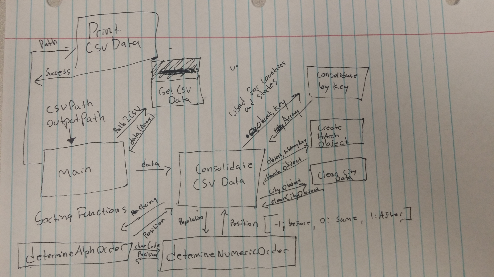

# Key Components Doc for <Project>
#### *Author: Eric Julander*
#### *Date: 5/13/2019*

# Preliminary Design

## Magic Box Chart



<!-- Think through the process as much as makes sense, and then create a magic box chart with the whiteboard and place it here. -->

## Explanation of Design
<!-- Add explanation of the Magic Boxes image above. Answers to the prompts below may also be appropriate to include here. -->
The program has one main function called "consolidateCSVData". It will reorganize data from the CSV array and format it into a hierarchical object after the format displayed in the [Project Capture Document](./ProjectCaptureDoc.md/). It also uses two sort functions to sort the cities by population and the states/countries by alphabetical order.

We will use these basic functions to put the object into the hierarchical format:

---
  > ### consolidateByKey(objectArray, sortingKey)

  It reduces an array of objects into one object where sub-objects 
  who share the same value at the specified key are grouped together 
  in an array. These arrays are stored in the reduced object under a key 
  named after their common value. 
  
  #### Params:
  >  __objectArray__: The array of objects to consolidate into one object with multiple sub-arrays.

  >  __sortingKey__: The key to sort the objects common values by.
 
---

> ### createHarchObject(object2Reduce, arrayName = "values")
  This takes the consolidated object and transfroms it into a hierarchical format.
  
  #### Params:
  > __object2Reduce:__ The object to put in the harch format.

  > __arrayName:__  The name of the key to store the array in.
 ___


> ### cleanCityData(city)
  This function takes the city object and strips it down to just its name and poulation. 
  #### Params:
  >__city:__ The city object created by the csv file.  
 ___


> ### determineNumbericOrder(number, number2Compare)
  This is used to generate the return for an Array.sort() method. Useful when tryng to sort two objects by the sub-properties they contain.
  #### Params:
  >__number:__ the number you would like to determine the order for.

  >__number2Compare:__ the number to compare the first number with.

  Returns (1 = after, -1 = before, 0 = same )
 
___

> ### determineAlphOrder(string1, string2)
  This is used to generate the return for an Array.sort() method when determining the alphabetic order of two strings. Useful when comparing two sub-properties of objects when sorting them.
  Note: This is dependent on the determineNumbericOrder function
  Returns (1 = after, -1 = before, 0 = same )
 
___
> ### consolidateCSVData(csvData)
  Consolidates the object array into one multi-dimensional object sorted in hierarchical order of country, state, city  with the countries and states sorted in alphabetical order and the cities sorted by population.
  ___
 


## Things to Consider Before Getting Project Approved
- Are there any approved libraries that I can use? [Link to Approved Library List]
- Are there design patterns that will help?  [Link to Design Patterns]
- Can I design it so that it is a general tool instead of a specific solution?
- How can it be easily expanded?
- What does the minimum viable product look like?

## Prep for Learning Phase
- What do I need to learn
- How will I learn it
- What will I do to learn it (prototypes/tutorials/research time limit?)
- What is the definition of done for my learning process
- How do I measure the progress of learning
- Is there a deliverable that can be created during the learning process?

-----

#### *Preliminary Design Approved By:* 
#### *Preliminary Design Approval Date:*

# Full Design

## Component Diagrams
> ## consolidateByKey (objectArray, sortingKey)
It reduces an array of objects into one object where sub-objects who share the same value at the specified key are grouped together in an array. These arrays are stored in the reduced object under a key named after their common value. 
#### Parameters:
> __objectArray:__ The array of objects to consolidate into one obhject with multiple sub-arrays.

>__sortingKey:__ The key to sort the objects common values by.

##### Returns:
It returns a consolidated object in the following format: 
```json
{ 
  "value1":
         [ { "sortingKey": "value1", "foo":"bar" },
           { "sortingKey": "value1", "foo":"bar" } ],
  "value2":
         [ { "sortingKey": "value2", "foo":"bar" },
           { "sortingKey": "value2", "foo":"bar" } ] 
}
```


#### Example:
```javascript
var states = [{
        "State Name": "State1",
        "Name": "City1",
        "Population": "12345"
    },
    {
        "State Name": "State2",
        "Name": "City1",
        "Population": "54321"
    }, {
        "State Name": "State1",
        "Name": "City2",
        "Population": "24680"
    },
    {
        "State Name": "State2",
        "Name": "City2",
        "Population": "86420"
    }
]

function consolidateByKey(objectArray, sortingKey) {
    return objectArray.reduce(function (consolidatedObject, object2Sort) {
        var depositArray = consolidatedObject[object2Sort[sortingKey]];
        consolidatedObject[object2Sort[sortingKey]] = (depositArray !== undefined) ? [].concat(depositArray, object2Sort) : object2Sort;
        return consolidatedObject;
    }, {});
}

console.log(consolidateByKey(states, "State Name"));
/*
{ 
    State1:
     [ 
         { 'State Name': 'State1', Name: 'City1', Population: '12345' },
         { 'State Name': 'State1', Name: 'City2', Population: '24680' } 
     ],
    State2:
     [ 
       { 'State Name': 'State2', Name: 'City1', Population: '54321' },
       { 'State Name': 'State2', Name: 'City2', Population: '86420' } 
     ] 
}
*/
console.log(consolidateByKey(states, "Name"));
/*
{ 
    City1:
     [ 
         { 'State Name': 'State1', Name: 'City1', Population: '12345' },
         { 'State Name': 'State2', Name: 'City1', Population: '54321' }
     ],
    City2:
     [ 
      
       { 'State Name': 'State1', Name: 'City2', Population: '24680' }, 
       { 'State Name': 'State2', Name: 'City2', Population: '86420' } 
     ] 
}
*/
```

> ## createHarchObject(object2Reduce, arrayName)
This takes the consolidated object and transfroms it into a hierarchical format.
#### Parameters:
> __object2Reduce:__ The object to put in the harch format.

> __arrayName:__ The name of the key to store the array in.
 
#### Returns:
Returns a hierarchical object looking like this:
```json
{
    "name": "The objects key",
    "values": "Array of sub-objects"    
}
```

#### Example:
```javascript
var states =

    {
        State1: [{
                'State Name': 'State1',
                Name: 'City1',
                Population: '12345'
            },
            {
                'State Name': 'State1',
                Name: 'City2',
                Population: '24680'
            }
        ],
        State2: [{
                'State Name': 'State2',
                Name: 'City1',
                Population: '54321'
            },
            {
                'State Name': 'State2',
                Name: 'City2',
                Population: '86420'
            }
        ]
    }

function createHarchObject(object2Reduce, arrayName = "values") {
    var newArray = [];
    for (var i in object2Reduce) {
        var tempObject = {};
        tempObject["name"] = i;
        tempObject[arrayName] = object2Reduce[i];
        newArray.push(tempObject);
    }
    return newArray;
}

console.log(createHarchObject(states, "cities"))
/* 
[ { 
  name: 'State1', 
  cities: [ 
            { 'State Name': 'State1', Name: 'City1', Population: '12345' },
            { 'State Name': 'State1', Name: 'City2', Population: '24680' }
          ] 
},
{ 
  name: 'State2', 
  cities: [ 
            { 'State Name': 'State2', Name: 'City1', Population: '54321' },
            { 'State Name': 'State2', Name: 'City2', Population: '86420' }  
          ]  
} 
]
*/
```
> ## cleanCityData(city)
This function takes the city object and strips it down to just its name and poulation. 

#### Parameters:
> __city:__ The city object created by the csv file. 

#### Returns:
The stripped city object in this format:
```json
{
    "Name": "city name",
    "Population": "city population"
}
``` 

> ## determineNumbericOrder(number, number2Compare)
This is used to generate the return for an Array.sort() method. Useful when tryng to sort two objects by the sub-properties they contain.
#### Parameters:
>__number:__ the number you would like to determine the order for.

>__number2Compare:__ the number to compare the first number with.

#### Returns:
A number representing the position of the compared number (Used as a return for the Array.sort() method):

|   |                                              |
|---:|----------------------------------------------|
|-1  | The number is less than the compared number  |
| 0  | The number is the same as the compared number |
| 1  | The number is greater than the compared number |


> ## determineAlphOrder(string1, string2)
This is used to generate the return for an Array.sort() method when determining the alphabetic order of two strings. Useful when comparing two sub-properties of objects when sorting them.
>*Note:* This is dependent on the __determineNumbericOrder__ function
#### Parameters:
>__string1:__ the string you would like to determine the order for.

>__string2:__ the string to compare the string number with.

#### Returns:
A number representing the position of the compared number (Used as a return for the Array.sort() method):

|   |                                              |
|---:|----------------------------------------------|
|-1  | The number is less than the compared number  |
| 0  | The number is the same as the compared number |
| 1  | The number is greater than the compared number |

### Used Libraries 
bin.js:
- d3-dsv
- fs
- strip-bom
- json-stringify-pretty-compact

Diagram:


Explanation:

The main function requires the user to input the file paths for the csvFile to read and then the output file. I then reads the csv data and sends it to the __consolidateCSV__ function. That function then takes the csv data and groups the different countries using the  __consolidateByKey__ function. It then runs that object thought the __createHarchObject__ function so that it is in the hierarchical structure. It then maps this array of countries to apply this same process to separate the states and cities within it. While it is doing this, it uses the __cleanCityData__ function to remove the metadata from the cities object. Once this process is done, it sorts the countries and states by aplhabetical order and the cities by population. The __consolidateCSV__ function then returns the cleaned and sorted hierarchical object. Main then passes this object to __printCSVData__ with the path of the output file. It then srigifies the object and prints it into the specified document.

<!-- For a future release:
## Test Plans
For each major function the test plan template will be as follows (in other words the template below will repeat for each test) 
### *Insert name of component here (e.g. convertIdToCourseObject function)*
#### Test 1: *Insert Test name here*
Summary: 
 *Insert Test Summary Here*
 Type: *Insert Type here (Unit Test, Manual Test, Selenium/Puppeteer test (Overkill?))* 
Procedure:
1. *Insert Steps here*
1. *and here*
1. *and here*
Expected Outcome:
*Insert Expected Outcome here*
-->

## Test Plans

### *Insert Module Name Here*
#### How to Test:


-----

#### *Full Design Approved By:* 
#### *Full Design Approval Date:*


<!-- Diagram Types:
 - Data Flow (I think this will be the most popular)
 - Structure Charts (This is really good for showing input and output of every function)
 - UML Class Diagram (a must for object oriented projects) -->


